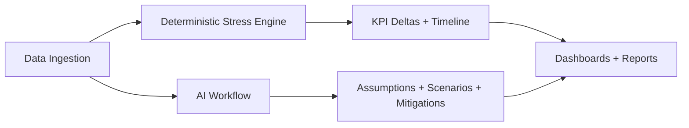

# StressTester

StressTester is a Next.js application for running AI-assisted financial stress tests. It combines deterministic simulations with optional AI workflows to extract assumptions, generate scenarios, and summarize results. The UI provides dashboards for KPIs, scenario timelines, mitigation playbooks, and data tables so teams can explore how operating plans perform under pressure.

## Problem

Stress testing matters because leadership teams need to understand how fragile cash flow, KPIs, and operational plans are under real-world shocks. Spreadsheet-based models break down quickly: they are brittle, hard to audit, and impossible to scale across scenarios, teams, and decision cycles.

## Solution

StressTester delivers an end-to-end workflow for financial stress testing: ingest structured company data, deterministically apply shocks to generate KPI deltas, and optionally run AI-assisted workflows that extract assumptions, propose scenarios, and generate mitigation playbooks. The result is a repeatable stress testing pipeline with clear lineage from inputs → shocks → outcomes → mitigation options.

## Demo

- **Live demo:** [https://your-demo-link.com](https://stress-tester-five.vercel.app/)
- **Screenshots / GIFs:**
  1. 
  2. 
  3. 

> Replace the placeholder demo link and images with your own hosted demo and UI captures.

## Architecture



**Flow overview**
- **Ingest structured finance + KPI data** (P&L, balance sheet, cash flow, operating metrics).
- **Apply deterministic shocks** to produce baseline vs. stressed KPI deltas.
- **Optionally run AI workflows** to extract assumptions, generate scenarios, and suggest mitigations.
- **Publish dashboards and reports** that connect inputs → stressors → outcomes → actions.

## Key Features (with screenshots)

### Assumption extraction
- Pulls business assumptions from uploaded operating plans and KPI notes.
- **Screenshot:** 

### Scenario generator
- Creates consistent stress scenarios aligned to market, revenue, cost, and liquidity risks.
- **Screenshot:** 

### Mitigation playbooks
- Drafts actionable mitigations tied to specific stress drivers.
- **Screenshot:** 

### Deterministic stress engine + KPI deltas
- Applies repeatable shocks and outputs baseline vs. stressed KPI deltas.
- **Screenshot:** 

### Data ingestion
- Accepts structured financial inputs and validates schemas before analysis.
- **Screenshot:** 

## How it works (technical)

### Data model (what the app expects)
- **Financial statements:** structured P&L, balance sheet, and cash flow line items.
- **KPI dataset:** definitions, historical values, and target ranges.
- **Assumptions metadata:** business drivers (pricing, churn, utilization, margin).
- **Scenario definitions:** shock magnitude, duration, and impact mapping.

### Deterministic engine (how shocks map to KPI changes)
- Stress scenarios define **shock vectors** (e.g., revenue decline, cost increase, liquidity compression).
- The engine **propagates shocks** through KPI formulas to compute deltas.
- Outputs include **baseline vs. stressed trajectories** and variance explanations.

### AI workflow (prompt stages + guardrails)
- **Stage 1:** Assumption extraction (structured highlights).
- **Stage 2:** Scenario generation (risk-aligned stressors).
- **Stage 3:** Mitigation playbooks (actionable responses).
- **Stage 4:** Executive summary (decision-ready narrative).

### Reliability & safety (super important for AI projects)

#### Schema validation / structured outputs
- AI outputs are forced into validated schemas before ingestion.
- Any invalid response is rejected and re-requested.

#### Guardrails (no “positive scenario” leakage; mitigations are the only “recovery” path)
- The system prohibits AI from generating “recovery” scenarios as stress outputs.
- Mitigations are the only approved pathway for improvement actions.

#### Determinism vs AI separation
- Deterministic stress calculations always remain source-of-truth.
- AI is optional and never mutates core KPI calculations.

## Local setup

### Prerequisites

- Node.js 18+
- pnpm (recommended) or npm/yarn

### Install Dependencies

```bash
pnpm install
```

### Run the App

```bash
pnpm dev
```

Visit `http://localhost:3000` to explore the StressTester UI.

## Useful Scripts

```bash
pnpm dev      # Run the development server
pnpm build    # Build for production
pnpm start    # Start the production server
pnpm lint     # Run linting
```

## Project Structure

- `app/` — Next.js app router, layouts, and pages
- `components/` — UI and stress-tester specific components
- `lib/` — Sample data, stress engine, and shared types
- `public/` — Static assets

## Roadmap

- **Data connectors** for ERP, CRM, and BI sources (NetSuite, Salesforce, Snowflake).
- **Scenario marketplace** with industry-specific stress packs.
- **Audit trails** for compliance reviews and model governance.
- **Scenario comparison dashboard** with KPIs across portfolios attachable to board decks.
- **Policy controls** for AI workflows (approval gates, logging, and red-team testing).

## License

MIT
